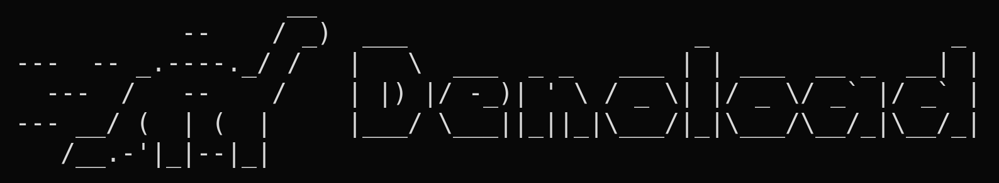

# 🦕 `denoload` - Accelerate web API load testing with seamless client library integration.



`denoload` is a versatile load testing tool engineered to simplify the load
testing of web services and similar backend components. It seamlessly integrate
with client libraries, empowering developers to create robust load tests in just
minutes. With `denoload`, you can verify the performance of your web services
under real-world conditions, all while enjoying a straightforward and efficient
testing process.

It is strongly inspired by [k6][k6].

## Why ?

[k6][k6] is a great tool but it's lacking of libraries and community due to its
custom JavaScript VM and API. Worse, there are edge cases where the VM isn't
standard and can not be. This can lead to a **lot** frustration.

`denoload` aims to be an alternative with:
- great performance (comparable to [k6][k6])
- write [k6][k6] like scripts with VUs, iterations and executors
- standard web APIs support (e.g. [fetch](https://developer.mozilla.org/en-US/docs/Web/API/Fetch_API))
- ESModules support
- Modern JavaScript & TypeScript support out of the box (including `async` /
  `await`)

This project is based on [Bun][bun].

## Example script

```ts
import { faker } from '@faker-js/faker'
import { GoTrueClient } from '@supabase/gotrue-js'
import { globalRegistry } from '@negrel/denoload-metrics'
import expect from 'expect'

export const options = {
  scenarios: {
    perVuIter: {
      executor: 'per-vu-iterations',
      vus: 256,
      iterations: 10
    }
  }
}

const AuthClient = new GoTrueClient({ url: 'http://gotrue.local' })
const signUpCounter = globalRegistry.Counter('signup')
const signOutCounter = globalRegistry.Counter('signout')

export default async function (): Promise<void> {
  // Sign up and sign in.
  {
    const { data, error } = await AuthClient.signUp({
      email: faker.internet.email(),
      password: faker.internet.password()
    })
    expect(error).toBeNull()
    expect(data).not.toBeNull()
    signUpCounter.add(1)
  }

  await Bun.sleep(1000)

  // Interact with your API...

  // Sign out.
  {
    const { error } = await AuthClient.signOut()
    expect(error).toBeNull()
    signOutCounter.add(1)
  }
}
```

See [examples/gotrue](./examples/gotrue/) to run the script locally.

## TODOs

Executors:
- [x] Per VU iterations
- [x] Shared iterations
- [x] Constant VUs
- [ ] Ramping VUs
- [ ] Constant Arrival Rate
- [ ] Ramping Arrival Rate

## Why `denoload` ?

The project was originally based on the [Deno](https://deno.land) runtime but I
switched to [Bun][bun] for VU [isolation using ShadowRealm](https://github.com/tc39/proposal-shadowrealm/).

## Contributing

If you want to contribute to `denoload` to add a feature or improve the code contact
me at [negrel.dev@protonmail.com](mailto:negrel.dev@protonmail.com), open an
[issue](https://github.com/negrel/denoload/issues) or make a
[pull request](https://github.com/negrel/denoload/pulls).

## :stars: Show your support

Please give a :star: if this project helped you!

[](https://www.buymeacoffee.com/negrel)

## :scroll: License

MIT © [Alexandre Negrel](https://www.negrel.dev/)

[k6]: https://k6.io/
[bun]: https://bun.sh/
